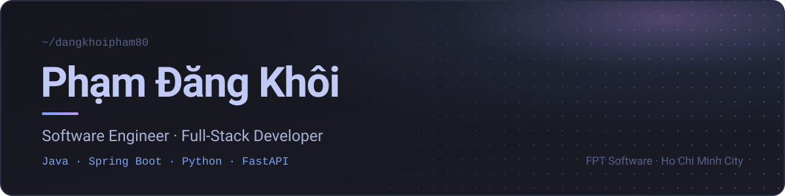

<!-- ══════════════════════════ HEADER ══════════════════════════ -->

<picture>
  <source media="(prefers-color-scheme: dark)" srcset="assets/header-dark.svg" />
  <source media="(prefers-color-scheme: light)" srcset="assets/header-light.svg" />
  
</picture>

  
  
  

  <a href="#about-me">About</a> &nbsp;·&nbsp;
  <a href="#tech-stack">Stack</a> &nbsp;·&nbsp;
  <a href="#projects">Projects</a> &nbsp;·&nbsp;
  <a href="#work">Work</a> &nbsp;·&nbsp;
  <a href="#current-focus">Focus</a> &nbsp;·&nbsp;
  <a href="#github-statistics">Stats</a> &nbsp;·&nbsp;
  <a href="#connect-with-me">Connect</a>

<!-- ══════════════════════════ ABOUT ══════════════════════════ -->

## About Me

Software Engineer at **FPT Software**. I build backend services with **Java (Spring Boot)** and **Python (FastAPI)**, and web apps with React and TypeScript.

I put **system design** first: thinking through architecture, trade-offs and scalability before writing code. Stacks change fast in the AI era, so I focus on fundamentals and pick up new technologies quickly when a project needs them.

<table>
  <tr>
    <td width="150"><b>Role</b></td>
    <td>Software Engineer at <b>FPT Software</b> — Ho Chi Minh City, Vietnam</td>
  </tr>
  <tr>
    <td><b>Core stack</b></td>
    <td>Java · Spring Boot · Python · FastAPI · React · TypeScript</td>
  </tr>
  <tr>
    <td><b>Building</b></td>
    <td><a href="https://github.com/dangkhoipham80/sightline"><b>Sightline</b></a>, the memory &amp; review layer for Claude Code, and <b>JobPilot</b></td>
  </tr>
  <tr>
    <td><b>Focus</b></td>
    <td>System design, microservices, cloud-native architecture</td>
  </tr>
  <tr>
    <td><b>Ask me about</b></td>
    <td>System Design · Java · Spring Boot · Python · FastAPI</td>
  </tr>
  <tr>
    <td><b>Portfolio</b></td>
    <td><a href="https://khoipham.vercel.app">khoipham.vercel.app</a></td>
  </tr>
  <tr>
    <td><b>Reach me</b></td>
    <td><a href="mailto:dangkhoipham80@gmail.com">dangkhoipham80@gmail.com</a></td>
  </tr>
  <tr>
    <td><b>Fun fact</b></td>
    <td>I think I am funny</td>
  </tr>
</table>

<!-- ══════════════════════════ TECH STACK ══════════════════════════ -->

## Tech Stack

<table>
  <tr>
    <td width="150"><b>Backend</b></td>
    <td>
       
      Java · Spring Boot · Python · FastAPI
    </td>
  </tr>
  <tr>
    <td><b>Frontend</b></td>
    <td>
       
      React · TypeScript · JavaScript · Tailwind CSS · HTML · CSS · Three.js
    </td>
  </tr>
  <tr>
    <td><b>Mobile</b></td>
    <td>
       
      Kotlin · React Native
    </td>
  </tr>
  <tr>
    <td><b>Data</b></td>
    <td>
       
      PostgreSQL · MySQL · MongoDB · Redis · Kafka · GraphQL
    </td>
  </tr>
  <tr>
    <td><b>DevOps &amp; Cloud</b></td>
    <td>
       
      Docker · Kubernetes · AWS · Google Cloud · Firebase · Jenkins · GitHub Actions · Nginx · Grafana
    </td>
  </tr>
  <tr>
    <td><b>Tools &amp; AI</b></td>
    <td>
       
      Git · Linux · Bash · Postman · PyTorch · TensorFlow · OpenCV
    </td>
  </tr>
</table>

<!-- ══════════════════════════ PROJECTS ══════════════════════════ -->

## Projects

<table>
  <tr>
    <td width="50%" valign="top">
      <h3><a href="https://github.com/dangkhoipham80/sightline">Sightline</a></h3>
      <i>Stop vibing blind.</i>
      
A clear line of sight into every Claude Code session, across every project — the memory &amp; review layer that turns raw <code>*.jsonl</code> session logs into something you can actually read.

      

        
        
        
      

      <a href="https://github.com/dangkhoipham80/sightline">Repository ↗</a>
    </td>
    <td width="50%" valign="top">
      <h3>JobPilot</h3>
      <i>CV autopilot, on your own machine.</i>
      
Crawl developer jobs → review them on a local dashboard → tailor your CV to one → approve the diff → apply → track what comes back. Built on the Awesome-CV LaTeX template.

      

        
        
        
        
      

      Private repository
    </td>
  </tr>
  <tr>
    <td width="50%" valign="top">
      <h3><a href="https://hunter-haven.hunterhaven.workers.dev">Hunter Haven</a></h3>
      <i>Working title</i>
      
An idle town-sim for the web, inspired by Evil Hunter Tycoon. Plays in a phone browser and installs like an app (PWA).

      

        
        
        
        
        
      

      <a href="https://hunter-haven.hunterhaven.workers.dev">Play the demo ↗</a> &nbsp;·&nbsp; Private repository
    </td>
    <td width="50%" valign="top">
      <h3><a href="https://khoipham.vercel.app">Portfolio</a></h3>
      <i>A full-stack app, not a static site.</i>
      
Monorepo personal site: a Next.js web app talking to a real FastAPI backend with migrations and a hosted Postgres — content lives in the database, not in hardcoded arrays.

      

        
        
        
        
        
      

      <a href="https://khoipham.vercel.app">Live site ↗</a> &nbsp;·&nbsp; Private repository
    </td>
  </tr>
</table>

<a href="https://github.com/dangkhoipham80?tab=repositories">All repositories →</a>

<!-- ══════════════════════════ WORK ══════════════════════════ -->

## Work

<!--
  Thêm dự án công ty / freelance: copy một khối <td> bên dưới.
  Muốn 2 cột thì đặt 2 <td width="50%"> trong cùng một <tr>.

    <td valign="top">
      <h3>Tên dự án</h3>
      <i>Công ty / Khách hàng · MM/YYYY – MM/YYYY</i>
      
Mô tả ngắn, vai trò của mình.

      
badge stack…

    </td>
-->

<table>
  <tr>
    <td valign="top">
      <h3>BlueOne</h3>
      
Monorepo for the BlueOne services: a CRM API and admin dashboard, a React Native management app with self-hosted OTA updates and an iOS self-install portal, plus a Zalo Mini Program with its web UI and API for timekeeping and payroll.

      

        
        
        
        
        
        
        
      

    </td>
  </tr>
</table>

<!-- ══════════════════════════ EXPERIENCE ══════════════════════════ -->

## Work Experience

<!--
  ┌─ HƯỚNG DẪN FILL ────────────────────────────────────────────────┐
  │ Copy khối <tr> mẫu bên dưới, thay nội dung, xoá dòng "Updating" │
  └─────────────────────────────────────────────────────────────────┘

<table>
  <tr>
    <td valign="top" width="200">
      <b>FPT Software</b> 
      MM/YYYY – Present · Ho Chi Minh City
    </td>
    <td>
      <b>Software Engineer</b>
      <ul>
        <li>Achievement 1</li>
        <li>Achievement 2</li>
        <li>Achievement 3</li>
      </ul>
    </td>
  </tr>
</table>
-->

<i>Updating…</i>

<!-- ══════════════════════════ EDUCATION & CERTS ══════════════════════════ -->

## Education &amp; Certifications

<!--
  Mẫu:
  - **B.Sc. Software Engineering** — FPT University · 20XX–20XX
  - **AWS Certified Solutions Architect – Associate** · 20XX · [Verify](link)
  - **Award / Hackathon** · 20XX
-->

<i>Updating…</i>

<!-- ══════════════════════════ FOCUS ══════════════════════════ -->

## Current Focus

| Focus area | Status | Priority |
|:-----------|:-------|:---------|
| **System Design** | `Practicing` | High |
| **Microservices with Spring Boot** | `In Progress` | High |
| **Cloud-Native Architectures** | `Learning` | High |
| **Open Source Contribution** | `Active` | Medium |
| **AI/ML Integration** | `Exploring` | Low |

<!-- ══════════════════════════ STATS ══════════════════════════ -->

## GitHub Statistics

<picture>
  <source media="(prefers-color-scheme: dark)" srcset="https://github-profile-summary-cards.vercel.app/api/cards/profile-details?username=dangkhoipham80&theme=tokyonight" />
  
</picture>

<picture>
  <source media="(prefers-color-scheme: dark)" srcset="https://github-profile-summary-cards.vercel.app/api/cards/stats?username=dangkhoipham80&theme=tokyonight" />
  
</picture>
<picture>
  <source media="(prefers-color-scheme: dark)" srcset="https://github-profile-summary-cards.vercel.app/api/cards/productive-time?username=dangkhoipham80&theme=tokyonight&utcOffset=7" />
  
</picture>
<picture>
  <source media="(prefers-color-scheme: dark)" srcset="https://github-profile-summary-cards.vercel.app/api/cards/most-commit-language?username=dangkhoipham80&theme=tokyonight" />
  
</picture>
<picture>
  <source media="(prefers-color-scheme: dark)" srcset="https://github-profile-summary-cards.vercel.app/api/cards/repos-per-language?username=dangkhoipham80&theme=tokyonight" />
  
</picture>

<picture>
  <source media="(prefers-color-scheme: dark)" srcset="https://raw.githubusercontent.com/dangkhoipham80/dangkhoipham80/output/github-contribution-grid-snake-dark.svg" />
  <source media="(prefers-color-scheme: light)" srcset="https://raw.githubusercontent.com/dangkhoipham80/dangkhoipham80/output/github-contribution-grid-snake.svg" />
  
</picture>

<!-- ══════════════════════════ BLOG ══════════════════════════ -->

## Latest Blog Posts

<!--
  Có thể tự động hoá: thêm workflow gautamkrishnar/blog-post-workflow
  và trỏ feed_list tới RSS (Medium / Dev.to / Hashnode).
  Các dòng bài viết sẽ được chèn tự động vào giữa 2 marker bên dưới.
-->

<!-- BLOG-POST-LIST:START -->
<!-- BLOG-POST-LIST:END -->

<i>Updating…</i>

<!-- ══════════════════════════ CONNECT ══════════════════════════ -->

## Connect with Me

  
  
  
  
  
  

  
  

 

From <a href="https://github.com/dangkhoipham80">dangkhoipham80</a> — thanks for stopping by!

